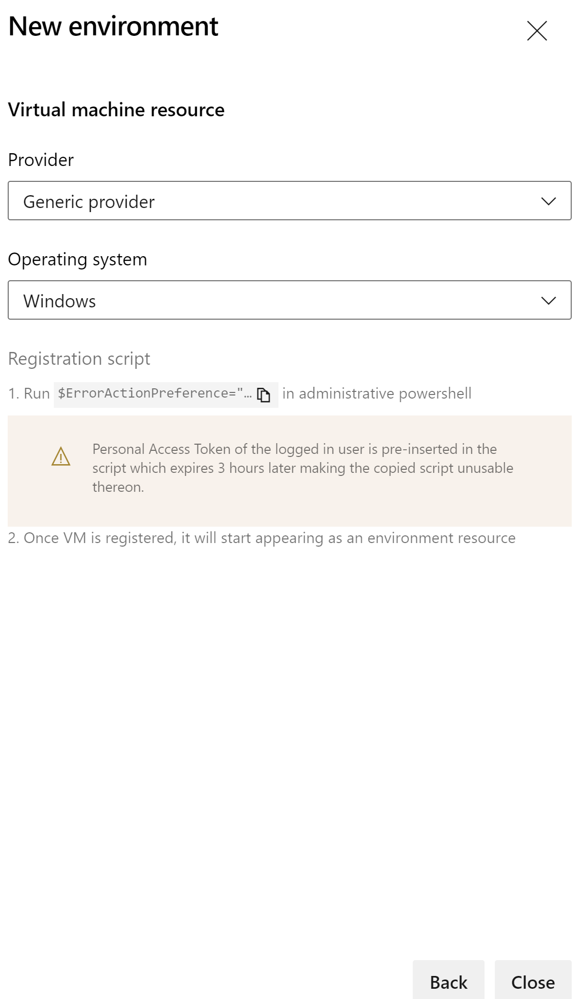
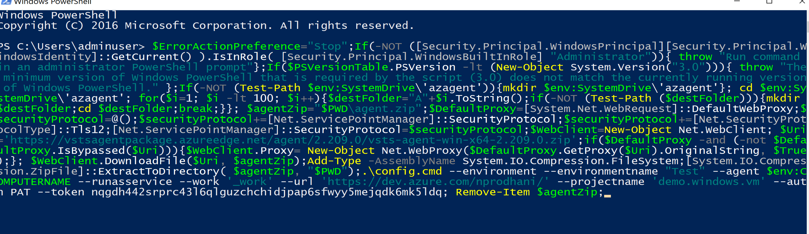

Steps to configure the DevOps agent in a VM

1. Navigate to the Azure DevOps account
2. Go to "Pipelines->Environments"
3. Click "New Environment"
4. Fill up the VM name, choose resource as "Virtual machines" and click "Next" 
5. Select the Provider as "Generic Provider" and Operating System as "Windows" 
6. Click and copy the "Registration Script" from the displayed window to your clipboard. We will use this inside the VM.
7. Click "Close"
8. RDP and login into the VM
9. Create an user account inside the VM with the service account information.
    * Go to "Settings->Other people"
    
    * Click "Add someone else to this PC"
    
    * Click "New User" and fill up the details per policy
    
    * Add the user to the "Administrator" group under the appropriate domain
    
    

10. Open a Powershell terminal with Administrator rights 
    * paste the previously copied script
    
    * On successful server connection, answer the questions in the menu presented
    
    * Fill up the form presented. A successful agent connection looks like 
    
